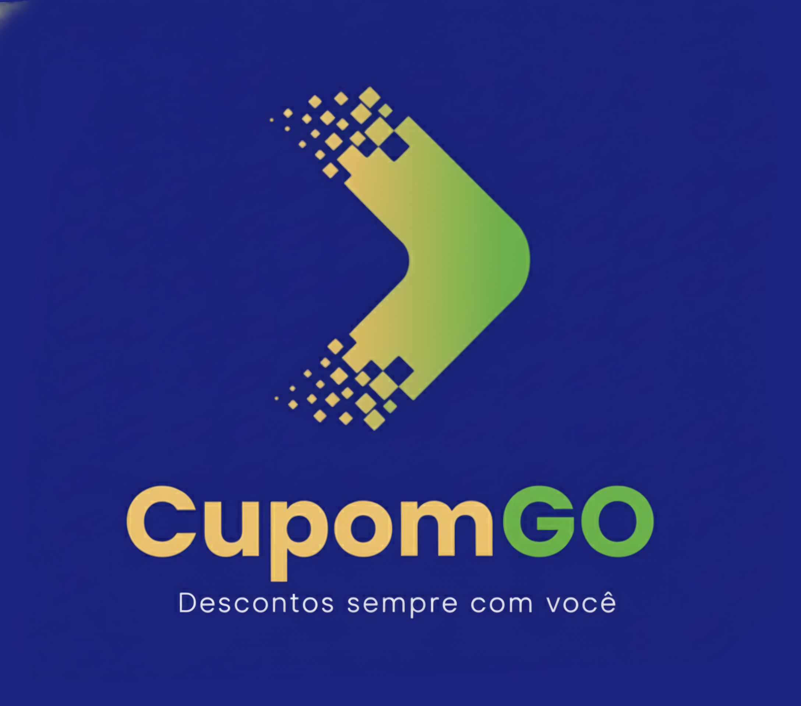

# FECAP - Fundação de Comércio Álvares Penteado

<p align="center">
<a href= "https://www.fecap.br/"></a>
</p>

# CupomGO

## Integrantes: <a href= "https://github.com/carlinhoslatorre"> Carlos Roberto Santos Latorre</a>,<a href ="https://github.com/1500341276"> Felipe Lin</a>,<a href= "https://www.linkedin.com/in/felipe-wakasa-76a93a257/"> Felipe Wakasa Klabunde </a>, <a href= "https://www.linkedin.com/in/stephany-aliyah-4a2589321/"> Stephany Aliyah Guimarães Eurípedes de Paula </a>

## Professores Orientadores: <a href="https://www.linkedin.com/in/eduardo-savino-gomes-77833a10/">Eduardo Savino Gomes</a>, <a href="https://www.linkedin.com/in/lucymari/">Lucy Mari Tabuti</a>, <a href="https://www.linkedin.com/in/mauricio-lopes-da-cunha-5630492a/">Mauricio Lopes Da Cunha</a>, <a href="https://www.linkedin.com/in/professorrodnil/">Rodnil da Silva Moreira Lisboa</a>.


## Descrição

<p align="center">
  
</p>


  
</p>
O CupomGO é um dashboard interativo desenvolvido em Python + Streamlit que analisa informações relacionadas ao uso de cupons em estabelecimentos parceiros.
O sistema reúne dados de transações, lojas, usuários, economia e utilização de cupons, permitindo gerar análises. O projeto apoia gestores nas áreas CEO, CTO e CFO, oferecendo KPIs específicos para cada perfil.
<br>


## 🛠 Estrutura de pastas
```
├── documentos/
│   ├── Entrega1/
│   │   ├── Análise Inferencial de Dados/
│   │   ├── Engenharia de Software e Arquitetura de Sistemas/
│   │   ├── Projeto Interdisciplinar Ciência de Dados/
│   │   └── Contabilidade e Finanças/
│   ├── Entrega2/
│   ├── Documentação.docx/
├── imagens/
├── src/
│   ├── Entrega 1/
│   │   ├── frontend/
│   │   └── backend/
│   ├── Entrega 2/
│   │   ├── frontend/
│   │   └── backend/
└── readme.md<br>
```

A pasta raiz contem dois arquivos que devem ser alterados:

<b>README.MD</b>: Arquivo que serve como guia e explicação geral sobre seu projeto. O mesmo que você está lendo agora.

Há também 4 pastas que seguem da seguinte forma:

<b>🗂️ documentos</b>: Pasta que reúne toda a documentação do projeto, incluindo arquivos das entregas, relatórios e materiais de apoio.

<b>📷 imagens</b>: Diretório para armazenar imagens do sistema, como logos, capturas de tela e elementos visuais utilizados na documentação.

<b>🧑‍💻 src</b>: Contém todo o código-fonte do projeto (frontend e backend), organizado por entregas.

## 🛠 Instalação

<b>Android:</b>

Faça o Download do JOGO.apk no seu celular.
Execute o APK e siga as instruções de seu telefone.

```sh
Coloque código do prompt de comnando se for necessário
```

<b>Windows:</b>

Não há instalação! Apenas executável!
Encontre o JOGO.exe na pasta executáveis e execute-o como qualquer outro programa.

```sh
Coloque código do prompt de comnando se for necessário
```

<b>HTML:</b>

Não há instalação!
Encontre o index.html na pasta executáveis e execute-o como uma página WEB (através de algum browser).

## 💻 Configuração para Desenvolvimento

Descreva como instalar todas as dependências para desenvolvimento e como rodar um test-suite automatizado de algum tipo. Se necessário, faça isso para múltiplas plataformas.

Para abrir este projeto você necessita das seguintes ferramentas:

-<a href="https://godotengine.org/download">GODOT</a>

```sh
make install
npm test
Coloque código do prompt de comnando se for necessário
```

## 📋 Licença/License
<p xmlns:cc="http://creativecommons.org/ns#" xmlns:dct="http://purl.org/dc/terms/">

  <a property="dct:title" rel="cc:attributionURL" href="https://github.com/2025-2-NCC4/Projeto5">
    CupomGO – Painel Econômico Interativo
  </a>
  by
  <a href="https://github.com/2025-2-NCC4/Projeto5" rel="cc:attributionURL dct:creator" property="cc:attributionName">
    Carlos Roberto Santos Latorre
  </a>,
  <a href="https://github.com/2025-2-NCC4/Projeto5" rel="cc:attributionURL dct:creator" property="cc:attributionName">
    Felipe Lin
  </a>,
  <a href="https://github.com/2025-2-NCC4/Projeto5" rel="cc:attributionURL dct:creator" property="cc:attributionName">
    Felipe Wakasa Klabunde
  </a>,
  <a href="https://github.com/2025-2-NCC4/Projeto5" rel="cc:attributionURL dct:creator" property="cc:attributionName">
    Stephany Aliyah Guimarães Eurípedes de Paula
  </a> is licensed under
<a href="https://creativecommons.org/licenses/by/4.0/?ref=chooser-v1"
     target="_blank" rel="license noopener noreferrer" style="display:inline-block;"> CC BY 4.0
    
    
  </a>

</p>


## 🎓 Referências

Aqui estão as referências usadas no projeto.

- <a href="https://streamlit.io/">Streamlit</a>
- <a href="https://pandas.pydata.org/">Pandas</a>
- <a href="https://plotly.com/python/">Plotly</a>
- <a href="https://nodejs.org/">Node.js</a>
- <a href="https://code.visualstudio.com/">Visual Studio Code</a>
- <a href="https://github.com/2025-2-NCC4/Projeto5/tree/main/src/data">Base de dados CupomGO</a>


